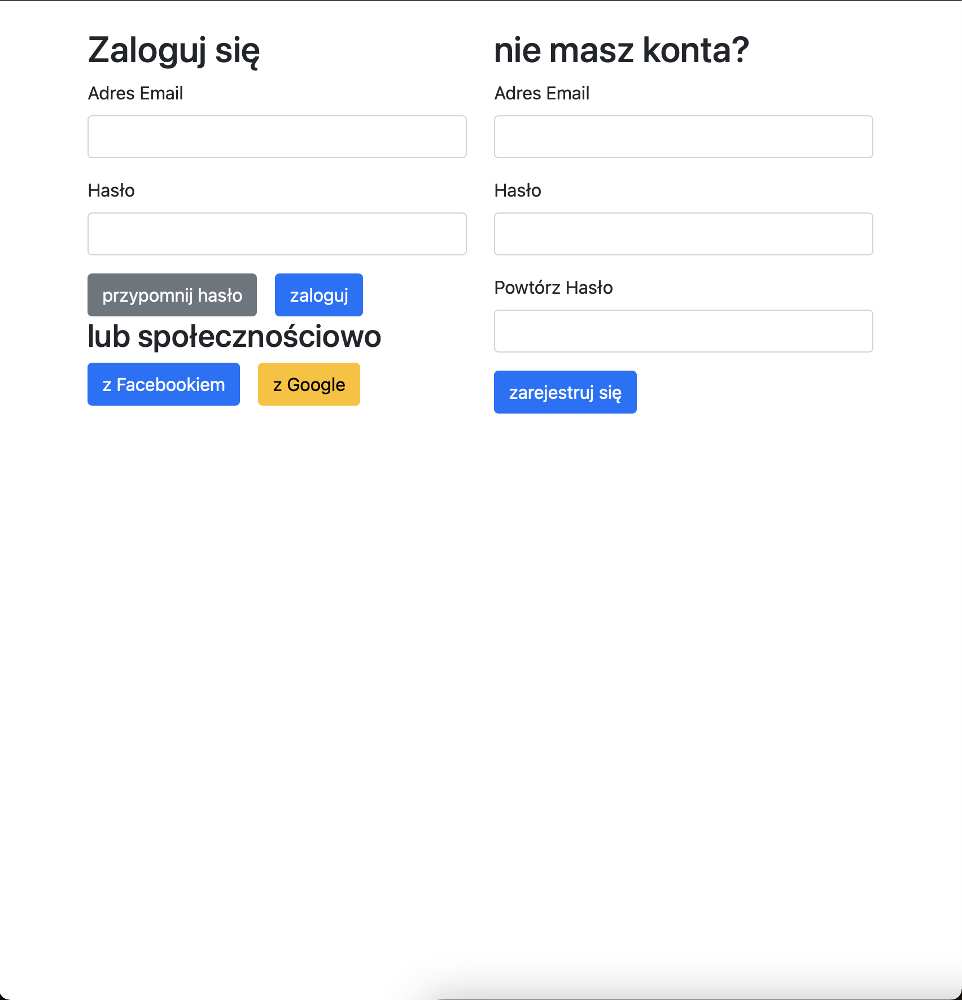
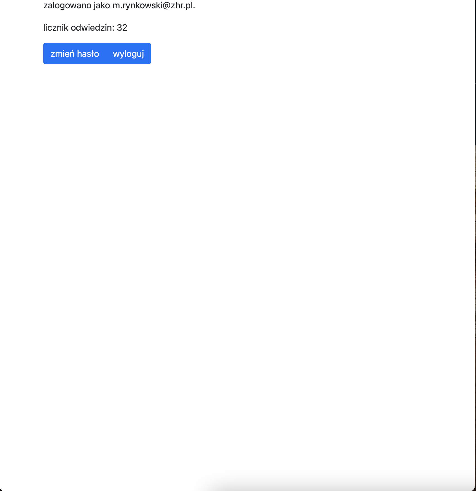
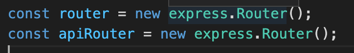
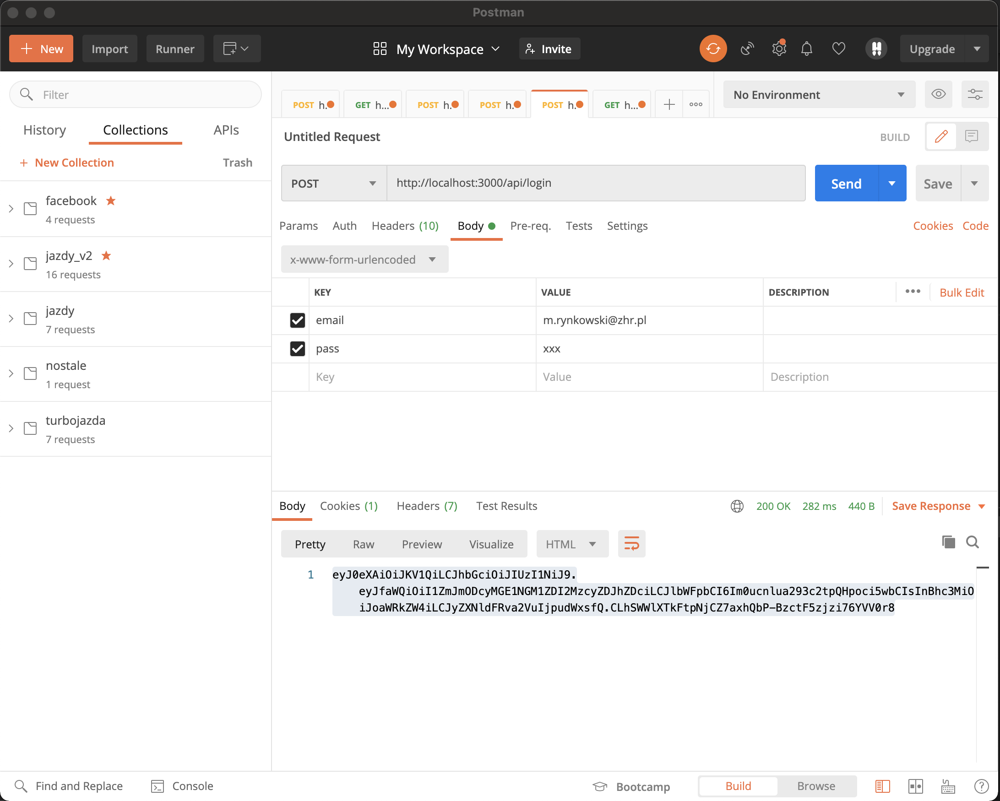
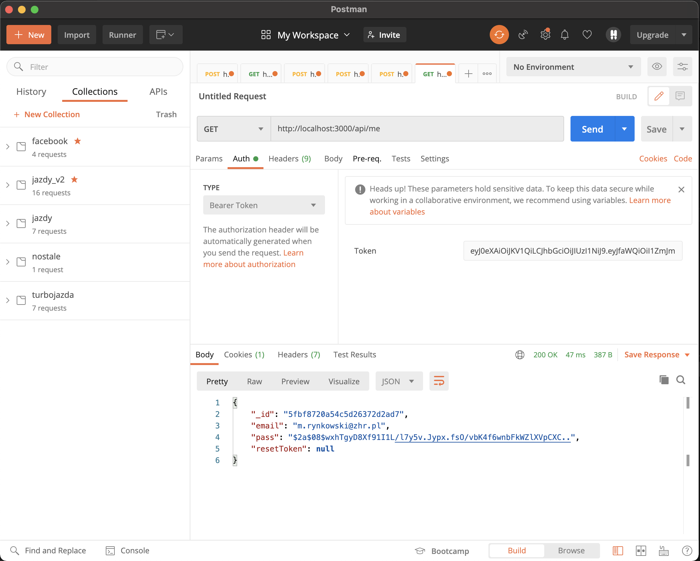

# Aplikacje Internetowe Lab 6

aby uruchomić ją samodzielnie, należy stworzyć w głównym folderze plik .env ze zmiennymi konfiguracyjnymi (lub dodać je przez panel konfiguracyjny, jeśli aplikacja instalowana jest np. na heroku). Ze względów bezpieczeństwa plik .env dodany jest do .gitignore.  
## lista zmiennych
- PORT
- SESSION_SECRET
- MAIL_AUTH_USER
- MAIL_AUTH_PASS
- MAIL_SMTP_SERVER
- MAIL_SMTP_PORT
- MAIL_FROM
- MONGO_CONNECTION_STRING
- MONGO_DB
- HASH_ROUNDS
- RESET_TOKEN_TIME
- JWT_SECRET
- FACEBOOK_APP_ID
- FACEBOOK_APP_SECRET
- GOOGLE_CLIENT_ID
- GOOGLE_CLIENT_SECRET
w zmiennej RESET_TOKEN_TIME, czas należy podać w sekundach

## opis
Zadanie przerobione z lab nr 3. Dodano licznik odwiedzin w cookies. Odpięto ścieżki z aplikacji i dodano do stworzonego routera - głównego oraz dodano drugi router z nowymi ścieżkami - przeznaczony do użytku jako api. Główny router korzysta z sesji i pozwala na tradycyjne logowanie lub przy pomocy facebooka/google (jak w lab 3). Router przeznaczony dla API korzysta z uwierzytelniania przez JWT.  
Sprawozdanie w formie zdjęć - opisy widoczne po najechaniu na zdjęcie.

